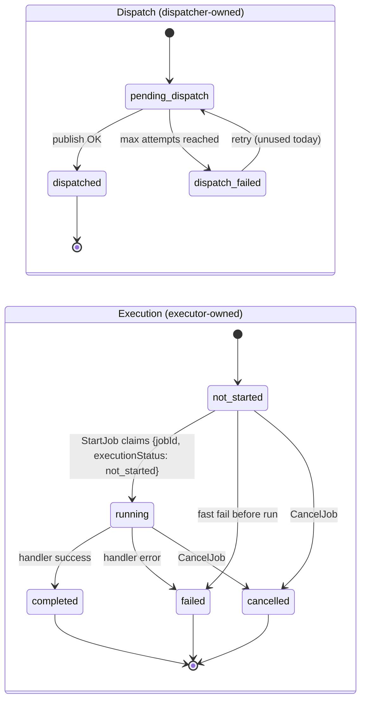

# Splitting dispatch and execution status

Proposed redesign of `job_metadata.status` that removes the [dispatch/executor race](./dispatch-executor-race.md) by construction, instead of making one ordering safe (option B) or enforcing an ordering (option A).
See that document for the race itself and for options A-E, which this design supersedes.

## Diagnosis: one field, two unrelated concerns

`status` currently does two jobs that happen to share one MongoDB field:

1. **The dispatcher's own retry bookkeeping.** `dispatched` means "I don't need to retry publishing this." This is a standard transactional-outbox concern, local to the dispatcher, and the current ordering (publish, then mark `dispatched`) is the textbook-correct, crash-safe way to do it: if the dispatcher crashes before marking `dispatched`, its own retry loop (the poll fallback) naturally republishes; marking it first and crashing before the publish would silently lose the job forever.
2. **The executor's readiness precondition.** `MarkRunningIfDispatched` gates on `status == dispatched` before letting a job run.

Only (1) is a real invariant. (2) was never actually guaranteed by anything: once the executor has received a Pulsar message, the message's existence already proves dispatch happened, more directly than a Mongo read of the dispatcher's own bookkeeping field ever could. Requiring `status == dispatched` as a precondition to run is a redundant, racy re-verification of something the delivery itself already proved. The two concerns don't need to share a field, and putting them on one is why the race is possible at all.

## Model: two owned sub-states, no shared gate

Split `status` into two fields, each written by exactly one actor:

- **`DispatchStatus`** — owned by the dispatcher only. `pending_dispatch → dispatched`, `pending_dispatch → dispatch_failed`, `dispatch_failed → pending_dispatch`. Unchanged from today's semantics and ordering.
- **`ExecutionStatus`** — owned by the executor and the cancel/retry endpoints only. `not_started → running`, `not_started → failed` (fast fail before run), `running → completed | failed`, `not_started | running → cancelled`.



The executor's claim, `MarkRunningIfDispatched`, becomes a single atomic update conditioned only on `ExecutionStatus`:

```text
UpdateOne({jobId, executionStatus: not_started}, {$set: {executionStatus: running, startedAt: now}})
```

It never reads `DispatchStatus`. The dispatcher can confirm before, during, or after the executor's claim — no interleaving makes a legitimate delivery look like a duplicate, because neither writer's precondition names the other's field. This isn't "make either ordering safe" or "force an ordering": there is no longer a shared precondition to race over.

One useful consequence: the dispatcher keeps the textbook-safe publish-then-confirm order exactly as it is today. Nothing downstream depends on that ordering finishing by any particular time, so the A-vs-B ordering question dissolves rather than getting resolved either way.

## Timestamps and logging fall out cleanly

- `dispatchedAt` is set exactly when `DispatchStatus` moves to `dispatched`, whenever that actually happens — including after execution has already started or finished. No approximation or backfill needed, unlike option B.
- `startedAt` / `completedAt` are set exactly when `ExecutionStatus` moves, same as today.
- The `"Job dispatched to queue"` log line fires whenever `MarkJobDispatched` succeeds, independent of execution progress. That is a true fact about the dispatch side on its own; it doesn't need to be contradiction-checked against execution.

## Display status (read-only projection)

External consumers (HTTP API, CLI, `ListFilter`) keep the current seven-value vocabulary. It is computed at read time, never persisted as a second source of truth, so there is nothing for two writers to race over:

| `DispatchStatus` | `ExecutionStatus` | Displayed `status` |
|---|---|---|
| `pending_dispatch` | `not_started` | `pending_dispatch` |
| `dispatched` | `not_started` | `dispatched` |
| `dispatch_failed` | `not_started` | `dispatch_failed` |
| any | `running` | `running` |
| any | `completed` | `completed` |
| any | `failed` | `failed` |
| any | `cancelled` | `cancelled` |

`ExecutionStatus` wins whenever it has moved past `not_started` — this correctly represents cases the current single field cannot: e.g. `DispatchStatus: pending_dispatch` and `ExecutionStatus: running` simultaneously is now a valid, meaningful, representable state (the executor claimed the job before the dispatcher's confirm write landed), not a bug to prevent.

## Migration

New fields plus a one-time backfill from the existing `status` value:

| Existing `status` | `DispatchStatus` | `ExecutionStatus` |
|---|---|---|
| `pending_dispatch` | `pending_dispatch` | `not_started` |
| `dispatched` | `dispatched` | `not_started` |
| `dispatch_failed` | `dispatch_failed` | `not_started` |
| `running` | `dispatched` | `running` |
| `completed` | `dispatched` | `completed` |
| `failed` | `dispatched` | `failed` |
| `cancelled` | `dispatched` (see caveat) | `cancelled` |

`running`/`completed`/`failed` unambiguously imply `dispatchStatus: dispatched`, since `CanTransitionTo` only allows `failed` via `dispatched` or `running`, never via `dispatch_failed`.

**Caveat:** `cancelled` is genuinely ambiguous on backfill. The single field doesn't record which dispatch phase a job was cancelled from (`pending_dispatch`, `dispatched`, or `running`), so historical data loses that distinction. Defaulting to `dispatched` is a reasonable, harmless choice for already-terminal documents, but it should be called out in the migration itself, not silently assumed.

Indexes (`idx_status`, `idx_status_priority_created`, `idx_pending_dispatch`) become compound indexes over the two fields.

## Query and API translation

Call sites that already know which phase they care about barely change: the poll fetcher already only queries `pending_dispatch`, which becomes a `DispatchStatus` filter with no `ExecutionStatus` component. Call sites using the external composite vocabulary (`ListFilter.Status`, CLI `--status`, HTTP filters) translate a requested `status` value into the corresponding field(s) using the same mapping table above, so the external contract is unchanged.

## Cancellation and retry

- **`CancelJob`** writes `ExecutionStatus: cancelled`. It no longer needs to read or write `DispatchStatus`.
- **Not fixed by this design, flagged as a separate, pre-existing gap:** a job cancelled while still `pending_dispatch` can still be published if the dispatcher reaches it first, since nothing here stops the dispatcher from publishing a cancelled job. This gap exists identically today (`CancelJob` racing the dispatch worker) and isn't introduced or worsened by this redesign. Worth its own issue if it matters in practice.
- **`RetryJob`** resets both sub-machines' entry points: `ExecutionStatus → not_started` and `DispatchStatus → pending_dispatch`, plus `dispatchAttempts` and the execution timestamps, instead of writing one shared field.

## Footprint

This is a genuine data-model change, not a local fix:

- `JobMetadataModel`: `DispatchStatus` and `ExecutionStatus` fields replace `Status`; a `DisplayStatus()` method computes the composite value.
- A new migration: fields, backfill (with the `cancelled` caveat called out), and index changes.
- `internal/jobs/mongodb`: `MarkRunningIfDispatched`, `MarkDispatchedIfPending`, `MarkDispatchFailedIfPending`, `CompleteIfRunning`, `RecordDispatchAttemptIfPending`, and the `ListFilter`/status-query building all move to the correct sub-field, or translate the composite value per the mapping table.
- `internal/jobs/service`: `CancelJob`, `RetryJob`, and the dispatch/execution summary counts (`metadata_service.go`'s status tally struct) update to the two fields.
- `cmd/jobs-cli`: output tables/filters keep the same `--status` vocabulary via the translation table.
- `internal/jobs/metadata/seed`: the fake-data generator produces consistent `(DispatchStatus, ExecutionStatus)` pairs instead of one weighted `JobStatus`.
- Docs: [job-status.md](./job-status.md) is superseded by the two orthogonal regions above; [dispatch-executor-race.md](./dispatch-executor-race.md)'s options A-E are superseded by this design for the record, not deleted.
- Tests across the mongo, service, executor, http, and cli packages wherever `status` is read or asserted.

## Related

- [dispatch-executor-race.md](./dispatch-executor-race.md) — the race this design removes, and the options considered before it (A-E), kept for the record.
- [job-status.md](./job-status.md) — the single-field state machine this design replaces.
- [job-saga.md](./job-saga.md)
