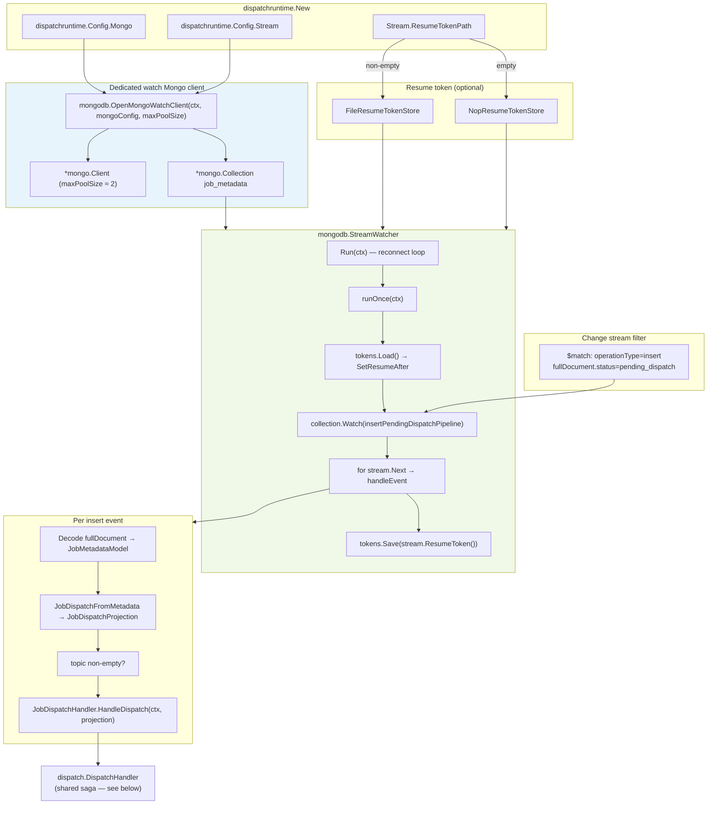
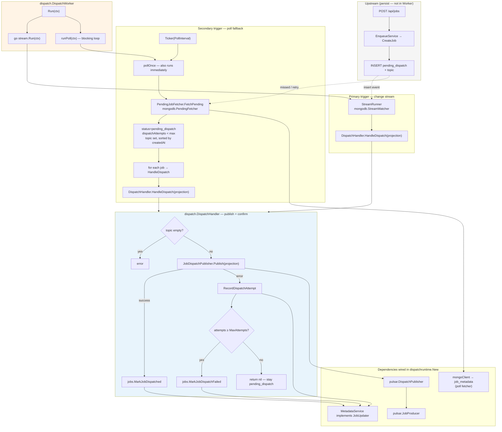

# Dispatch worker architecture

Internal reference for `internal/jobs/dispatch/` — how the MongoDB **watch client** (change stream) and the **dispatch worker** (dual triggers + saga handler) fit together via **`internal/jobs/dispatchruntime`** in **`cmd/jobs-dispatcher`**. The HTTP API in **`cmd/jobs-server`** only persists `pending_dispatch`; dispatch runs in a separate process.

**Code layout**

```text
internal/jobs/dispatch/       # orchestration + saga (transport-agnostic)
├── worker.go, handler.go     # DispatchWorker, DispatchHandler
├── types.go                  # JobDispatchPublisher, JobDispatchHandler, JobUpdater, …
└── (unit tests only)

internal/jobs/dispatchruntime/  # composition root (wire mongo + pulsar + dispatch)
├── config.go                 # Config, ConfigFromEnv
└── runtime.go                # New, Run, Close

internal/jobs/mongodb/        # Mongo implementations
├── stream.go                 # StreamWatcher (change stream consumer)
├── pending.go                # PendingFetcher (poll fallback queries)
├── resume_token.go           # FileResumeTokenStore | NopResumeTokenStore
└── mongo_connection.go       # OpenMongoWatchClient (dedicated watch client)

internal/jobs/pulsar/         # Pulsar adapter (DispatchPublisher, JobProducer)

internal/jobs/integrationtest/  # cross-package saga integration tests

cmd/jobs-dispatcher/          # env loading + dispatchruntime.New
```

---

## Watch client — change stream path

The watch path uses a **separate MongoDB client** (small pool, long-lived cursor) and `mongodb.StreamWatcher`, which implements `dispatch.StreamRunner`.



### Behavior

| Step | What happens |
|------|----------------|
| **Client isolation** | API traffic uses `mongodb.OpenMongoJobs`; the watcher uses `mongodb.OpenMongoWatchClient` so the change stream does not compete with the main connection pool. |
| **Filter** | Only **inserts** whose `fullDocument.status` is `pending_dispatch` (jobs created by enqueue, not updates). |
| **Resilience** | `Run` loops: on cursor error it logs and reconnects; `runOnce` reopens the stream. |
| **Resume** | After each successful `Next`, the resume token is persisted (file) or dropped (nop). |
| **Handler contract** | `StreamWatcher` depends on `dispatch.JobDispatchHandler` — `main` passes `*dispatch.DispatchHandler` as that implementation. |

Replica set is required for change streams (see [Environment](../dev/environment.md)).

---

## Dispatch worker — dual triggers + saga

`dispatch.DispatchWorker` starts the watch goroutine and runs a **poll fallback** on the main goroutine. Both paths call the same `Handler` (Pulsar publish + metadata status updates). **`dispatchruntime.New`** assembles the worker, Pulsar publisher, and Mongo adapters.



### End-to-end flow

```text
Persist (HTTP)          Publish + confirm (Worker)
─────────────────       ─────────────────────────────────────
Enqueue → INSERT        ┌─ Change stream (primary, fast)
  pending_dispatch      │
                          └─ Poll (fallback, catches gaps / retries)
                                    │
                                    ▼
                              DispatchHandler.HandleDispatch
                                    │
                    ┌───────────────┴───────────────┐
                    ▼                               ▼
             Pulsar publish                  Mongo status update
             (jobId key)                     dispatched / attempts / dispatch_failed
```

### Why two triggers

| Trigger | Role |
|---------|------|
| **Change stream** | Low-latency reaction to new `pending_dispatch` rows after enqueue. |
| **Poll** | Safety net: stream gaps, restarts without resume token, publish retries left in `pending_dispatch`, broker outages. |

HTTP returns **201** after the persist step; publish and confirm run asynchronously in the dispatch worker.
