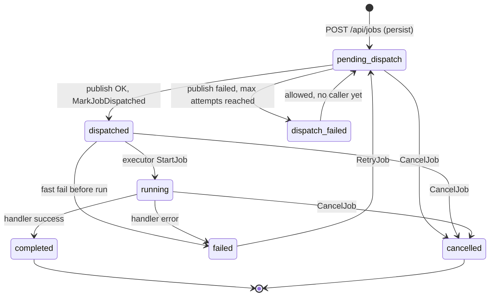

# Job status state machine (superseded)

> **Deprecated.** This document describes the original single-field `status` design.
> The current implementation stores state in two independent fields, `dispatchStatus` and `executionStatus`, and computes the external status on read via `DisplayStatus()`.
> See the [dispatch-execution-status-split overview](../planning/dispatch-execution-status-split/overview.md) and [design doc](../planning/dispatch-execution-status-split/dispatch-execution-status-split.md) for the active design.

A job's `status` covered both the dispatch phase (MongoDB to Pulsar) and the execution phase.
The allowed transitions were defined by `JobStatus.CanTransitionTo` in `internal/jobs/metadata/interface.go`.
The conditional writes in `internal/jobs/mongodb/mongo_writer.go` enforced them per transition.

See [job-saga.md](./architecture/job-saga.md) for the dispatch phase and [dispatch-worker.md](./architecture/dispatch-worker.md) for the worker wiring.

## Diagram

## Transitions

| From | To | Triggered by |
|------|----|--------------|
| (new) | `pending_dispatch` | `EnqueueService.Enqueue` (persist step) |
| `pending_dispatch` | `dispatched` | `MarkJobDispatched`, after a successful Pulsar publish |
| `pending_dispatch` | `dispatch_failed` | `MarkJobDispatchFailed`, when publish attempts reach `MaxAttempts` |
| `pending_dispatch` | `cancelled` | `CancelJob` |
| `dispatch_failed` | `pending_dispatch` | Allowed by `CanTransitionTo`; no service code performs it today |
| `dispatched` | `running` | `StartJob` (`MarkRunningIfDispatched`) in the executor |
| `dispatched` | `cancelled`, `failed` | `CancelJob`, `FailJob` |
| `running` | `completed`, `failed`, `cancelled` | `CompleteJob`, `FailJob`, `CancelJob` |
| `failed` | `pending_dispatch` | `RetryJob` (only from `failed`) |

## Terminal and non-terminal states

- **Terminal:** `completed`, `failed`, `cancelled` (`IsTerminal`).
  Only `failed` has an outgoing transition, back to `pending_dispatch` through `RetryJob`.
- **Non-terminal:** `pending_dispatch`, `dispatched`, `dispatch_failed`, `running`.
  `dispatch_failed` is recoverable and deliberately not terminal.
- **Dispatch phase:** `pending_dispatch`, `dispatched`, `dispatch_failed` (`IsDispatchPhase`).

## Superseded by a status split

The transitions `pending_dispatch` to `dispatched` and `dispatched` to `running` were written by two different services (dispatcher and executor), which created a race described in [dispatch-executor-race.md](./architecture/dispatch-executor-race.md).
The split design, [dispatch-execution-status-split.md](../planning/dispatch-execution-status-split/dispatch-execution-status-split.md), replaced the single `status` field with two independently-owned fields.
This document is kept for historical context only.
